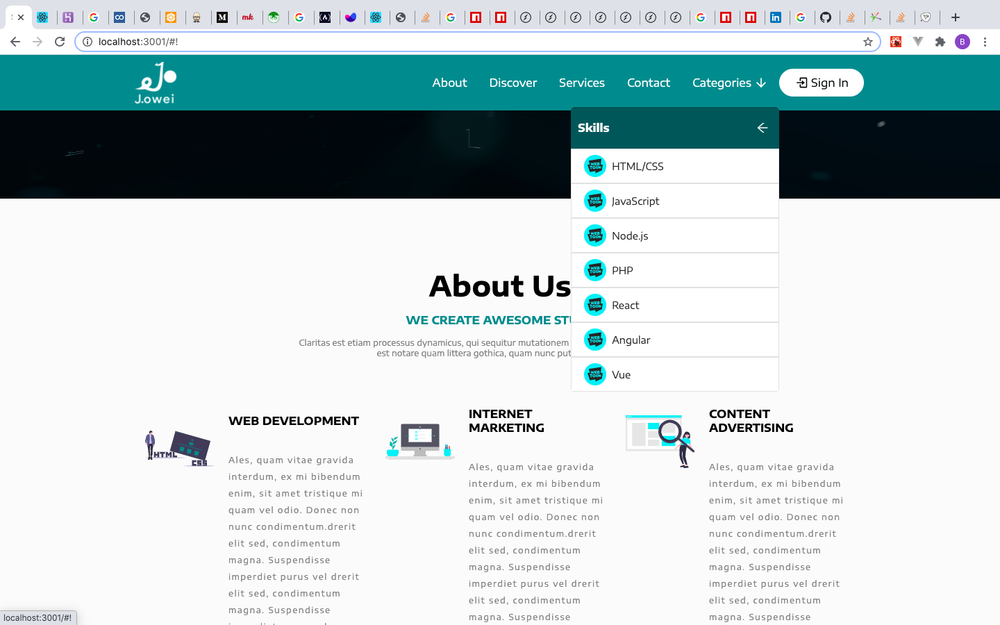

# Styled Components React Template 

### Screenshots




### Setup

In the project directory, you can run:

```
npm install
```
```
npm start
```

Build for Production

```
npm run build
```


See [Live Demo on Heroku](https://joshie-styled-components-temp.herokuapp.com/)

See [Live Demo on Netlify](https://styled-components-react-template.netlify.app/)